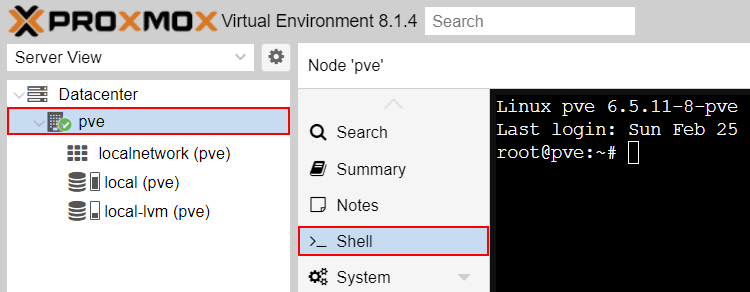
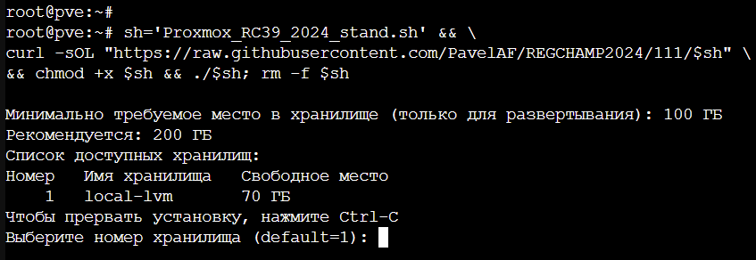

# REGCHAMP2024
1.  Открываем Proxmox, выбираем нужную Node и переходим в раздел
    “Shell”.

2. Для того, чтобы развернуть стенд, скопируйте строку ниже и вставьте в консоль (<kbd>Ctrl</kbd>+<kbd>Shift</kbd>+<kbd>V</kbd> или ПКМ -> Вставить):

```
sh='Proxmox_RC39_2024_stand.sh';curl -sOL "https://raw.githubusercontent.com/PavelAF/REGCHAMP2024/111/$sh"&&chmod +x $sh&&./$sh;rm -f $sh
```

После нажатия <kbd>Enter</kbd> скрипт запустится. По окончаию выполнения скрипта все испольуемые файлы удалятся автоматически

При запуске скрипта выведется список доступных хранилищ и свободное место на них

3. Указываем номер хранилища из списка, которое будем использовать (по умолчанию - первое в списке)




> После этого ждем.

4.  Стенд развернут!
